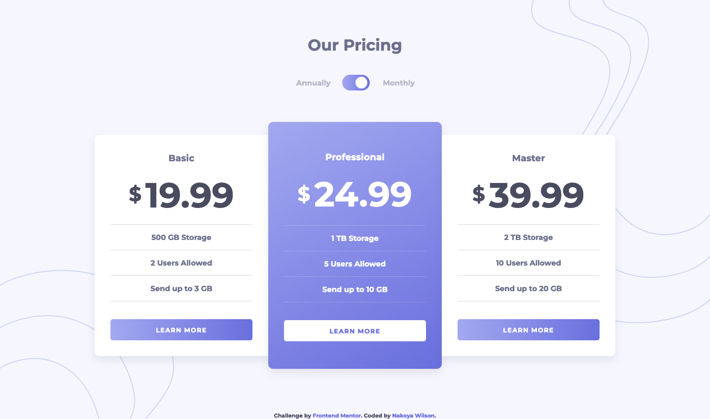

# Frontend Mentor - Pricing component with toggle solution

This is a solution to the [Pricing component with toggle challenge on Frontend Mentor](https://www.frontendmentor.io/challenges/pricing-component-with-toggle-8vPwRMIC). Frontend Mentor challenges help you improve your coding skills by building realistic projects.

## Table of contents

- [Overview](#overview)
  - [The challenge](#the-challenge)
  - [Screenshot](#screenshot)
  - [Links](#links)
- [My process](#my-process)
  - [Built with](#built-with)
- [Author](#author)

## Overview

### The challenge

Users should be able to:

- [x] View the optimal layout for the component depending on their device's screen size
- [x] Control the toggle with both their mouse/trackpad and their keyboard
- [ ] **Bonus**: Complete the challenge with just HTML and CSS

### Screenshot

### Links

- Solution URL: [https://www.frontendmentor.io/solutions/pricing-component-with-toggle-using-flexbox-vFV9fc8Ya](https://www.frontendmentor.io/solutions/pricing-component-with-toggle-using-flexbox-vFV9fc8Ya)
- Live Site URL: [https://nakoyawilson.github.io/pricing-component-with-toggle/](https://nakoyawilson.github.io/pricing-component-with-toggle/)

## My process

### Built with

- HTML
- CSS
- JavaScript
- Flexbox

## Author

- Website - [Nakoya Wilson](https://nakoyawilson.netlify.app/)
- Frontend Mentor - [@nakoyawilson](https://www.frontendmentor.io/profile/nakoyawilson)
- Twitter - [@nakoyawilson](https://twitter.com/nakoyawilson)
- LinkedIn - [@nakoyawilson](https://www.linkedin.com/in/nakoyawilson/)
